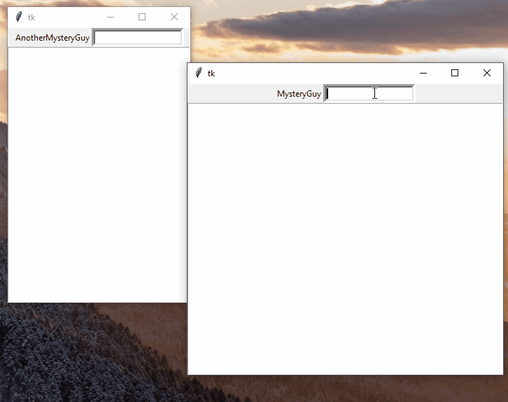
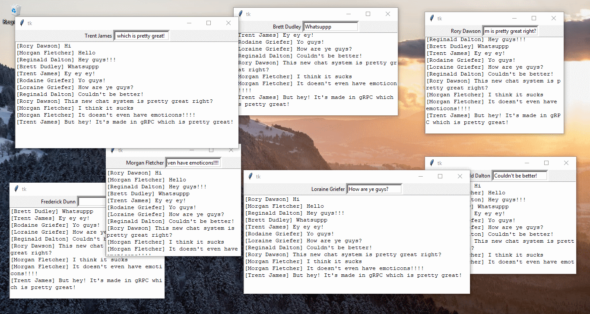

# Python gRPC Chat
Chat application created with gRPC. This was a study for bidirectional gRPC streaming.

# Demo





## Server

```python
class ChatServer(rpc.ChatServerServicer):

    def __init__(self):
        # List with all the chat history
        self.chats = []

    # The stream which will be used to send new messages to clients
    def ChatStream(self, request_iterator, context):
        """
        This is a response-stream type call. This means the server can keep sending messages
        Every client opens this connection and waits for server to send new messages

        :param request_iterator:
        :param context:
        :return:
        """
        lastindex = 0
        # For every client a infinite loop starts (in gRPC's own managed thread)
        while True:
            # Check if there are any new messages
            while len(self.chats) > lastindex:
                n = self.chats[lastindex]
                lastindex += 1
                yield n

    def SendNote(self, request: chat.Note, context):
        """
        This method is called when a clients sends a Note to the server.

        :param request:
        :param context:
        :return:
        """
        print("[{}] {}".format(request.name, request.message))
        # Add it to the chat history
        self.chats.append(request)
        return chat.Empty()
```

## Client

```python
address = 'localhost'
port = 11912


class Client:

    def __init__(self, u: str, window):
        # the frame to put ui components on
        self.window = window
        self.username = u
        # create a gRPC channel + stub
        channel = grpc.insecure_channel(address + ':' + str(port))
        self.conn = rpc.ChatServerStub(channel)
        # create new listening thread for when new message streams come in
        threading.Thread(target=self.__listen_for_messages, daemon=True).start()
        self.__setup_ui()
        self.window.mainloop()

    def __listen_for_messages(self):
        """
        This method will be ran in a separate thread as the main/ui thread, because the for-in call is blocking
        when waiting for new messages
        """
        for note in self.conn.ChatStream(chat.Empty()):
            print("R[{}] {}".format(note.name, note.message))
            self.chat_list.insert(END, "[{}] {}\n".format(note.name, note.message))

    def send_message(self, event):
        """
        This method is called when user enters something into the textbox
        """
        message = self.entry_message.get()
        if message is not '':
            n = chat.Note()
            n.name = self.username
            n.message = message
            print("S[{}] {}".format(n.name, n.message))
            self.conn.SendNote(n)
            
    ...
```

## The proto file

```proto
syntax = "proto3";

package grpc;

message Empty {}

// I called it Note because message Message is annoying to work with
message Note {
    string name = 1;
    string message = 2;
}

service ChatServer {
    // This bi-directional stream makes it possible to send and receive Notes between 2 persons
    rpc ChatStream (Empty) returns (stream Note);
    rpc SendNote (Note) returns (Empty);
}
```
